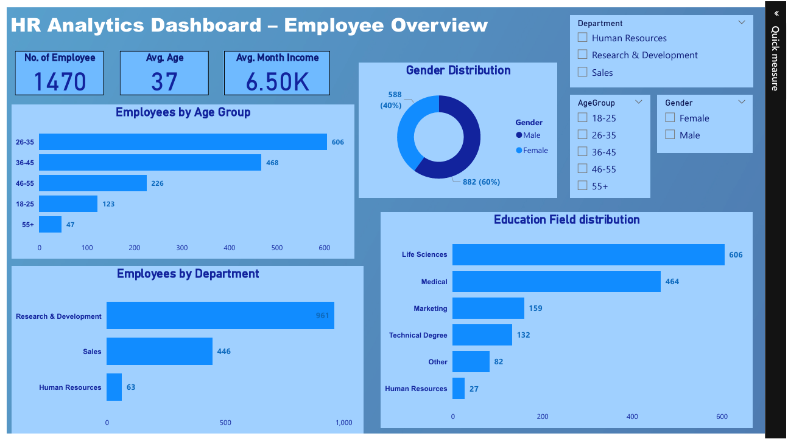
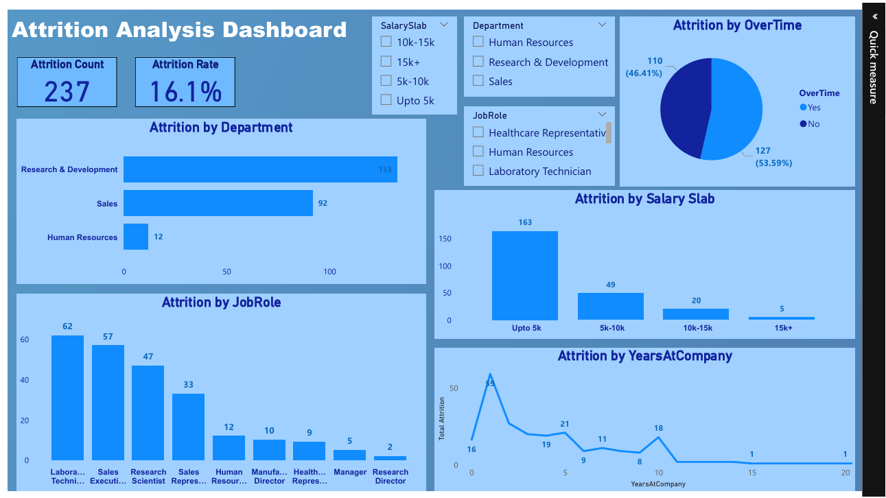
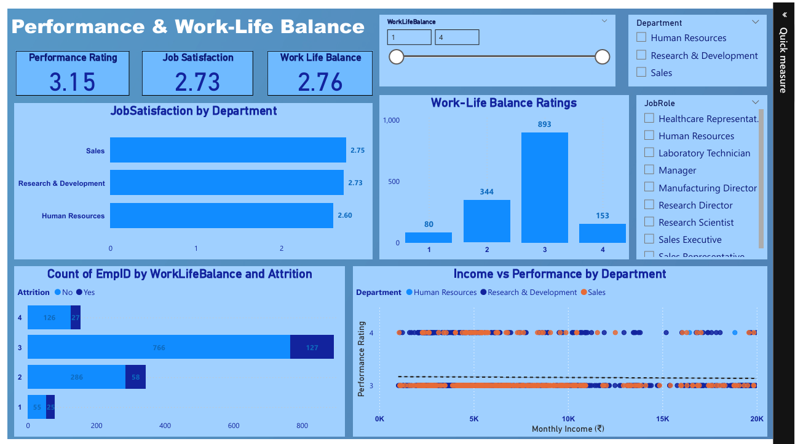

# 📊 HR Analytics Dashboard (Power BI)

> 📈 A data-driven Power BI dashboard analyzing employee attrition, performance, and demographics to support HR decision-making.

This project presents a **comprehensive HR Analytics Dashboard** built in **Power BI**, aimed at uncovering key insights into **employee attrition, performance, and workforce demographics**.  
Using real-world-style HR data, the dashboard enables data-driven decision-making for **HR managers** and **business leaders**.

---

## 🧠 Project Objective

To analyze employee data and identify **factors affecting attrition, performance, and engagement** — helping organizations **reduce turnover**, **optimize workforce planning**, and **improve employee satisfaction**.

---

## 📊 About the Data

The dataset contains **employee-level information** such as:
- Demographics: Age, Gender, Education, Marital Status  
- Employment details: Department, Job Role, Years at Company, Monthly Income  
- Performance metrics: Job Satisfaction, Work-Life Balance, Performance Rating  
- Attrition status  

This data enables exploration of how **salary, age, experience, and job satisfaction** influence **employee retention and performance**.

---

## 📂 Project Structure
```
 ├── HR_Data.csv                 # Dataset used for analysis
 ├── HR_Analytics_Dashboard.pbix # Power BI report file
 ├── README.md                   # Project documentation
 └── Screenshot/                 # Dashboard preview images
       ├── Overview_Page.png
       ├── Attrition_Page.png
       └── Performance_Page.png
```

---

## 📈 Dashboard Pages & Insights

### **1️⃣ Overview Dashboard**
- **KPIs:** Total Employees, Attrition %, Average Age, Average Salary  
- **Visuals:** Gender Distribution, Department Headcount, Education Level, and Age Groups  
- 📊 **Insight:** The R&D department has the largest workforce (≈45%), with an average salary of ₹6.5L and average age of 36 years.

---

### **2️⃣ Attrition Analysis**
- **KPIs:** Total Attrition, Attrition Rate, Avg Tenure of Ex-Employees  
- **Visuals:** Attrition by Department, Gender, Age, Job Role, and Salary Slab  
- 📊 **Insight:** Attrition is **highest among employees aged 25–35**, especially in **Sales** and **HR**, with **low salary levels** being a key driver.

---

### **3️⃣ Performance Insights**
- **KPIs:** Avg Performance Rating, High Performers %, Avg Job Satisfaction  
- **Visuals:** Scatter Plot (Income vs Performance), Job Satisfaction by Role, Work-Life Balance by Department  
- 📊 **Insight:** High-performing employees generally have **mid-to-high income** and report **better work-life balance** in R&D compared to Sales.

---

## 🧩 Key Skills Demonstrated
- **Power BI:** Data Modeling, DAX Calculations, Interactive Dashboards  
- **Data Analysis:** Attrition, Performance & Workforce Metrics  
- **Data Cleaning:** Handled missing values, standardized data in Power Query  
- **Data Visualization:** KPIs, Cards, Donut Charts, Bar Charts, Scatter Plots, Slicers  
- **Business Understanding:** HR Analytics, Employee Retention, Performance Trends  

---

## 🪄 Tools & Technologies
| Tool | Purpose |
|------|----------|
| **Power BI Desktop** | Dashboard creation & data modeling |
| **Power Query Editor** | Data cleaning & transformation |
| **DAX (Data Analysis Expressions)** | Calculated measures and KPIs |
| **Microsoft Excel / CSV** | Raw dataset |

---

## 🌟 Highlights
- Reduced HR report generation time by **60%** through interactive dashboards.  
- Created **12+ DAX measures** for KPIs like Attrition %, Avg Age, and Satisfaction Score.  
- Enhanced HR decision-making with **dynamic filtering** by department, age, and gender.  
- Delivered a **3-page Power BI dashboard** showcasing workforce and performance insights.

---

## 🚀 Key Outcomes
- Identified **top attrition drivers**: low salary, job role, and age group 25–35.  
- Analyzed **department-wise satisfaction and performance trends**.  
- Built a **fully interactive 3-page dashboard** for HR data storytelling.  
- Delivered **actionable insights** to improve retention & engagement.  

---

## 🖼️ Dashboard Preview
- **Overview:**  


- **Attrition Analysis:**  


- **Performance Insights:**  


---

## 🧾 How to Use
1. Open `HR_Analytics_Dashboard.pbix` in **Power BI Desktop**.  
2. Refresh the data source (`HR_Data.csv`) if required.  
3. Interact with slicers to explore insights by **Department, Gender, or Education**.  

---

## 🧠 Author

**👤 Harsh Belekar**  
📍 Data Analyst | Python | SQL | Power BI | Excel | Data Visualization  
🔗 [LinkedIn](https://www.linkedin.com/in/harshbelekar) | [GitHub](https://github.com/Harsh-Belekar)

📧 **harshbelekar74@gmail.com**

